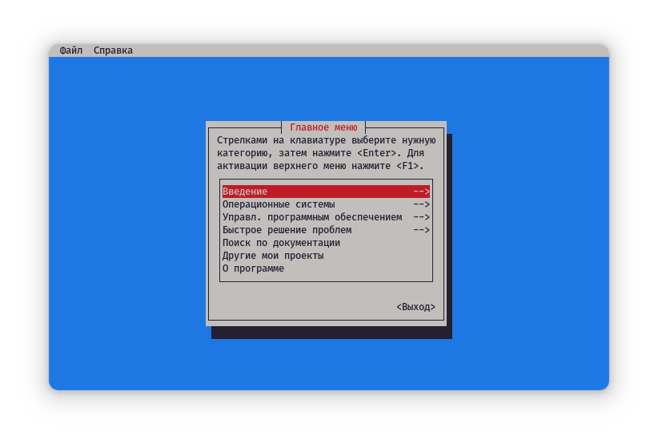

# Helper [WIP - 1.0.0 coming soon]

[WIP] Helper - интерактивная консольная программа, содержащая инструкции по использованию различных команд операционных систем семейства UNIX (на данный момент Helper собирается только для Linux, однако возможно портирование и на другие Unix'ы, например на FreeBSD).

[](assets/screenshots.md)

[Больше скриншотов здесь...](assets/screenshots.md)

## Структура проекта

- `src/` - исходный код программы (Rust);
- `res/` - ресурсы программы (файлы документации, отображаемые в программе);

## Сборка

### Зависимости

- `rustc`, `cargo`, `gcc`
- `ncurses`, `glibc`

### Локальная сборка

```bash
cargo build --release

sudo mkdir -pv /usr/share/helper
sudo cp -rv ./res/* /usr/share/helper/
sudo cp -v ./target/release/helper /usr/bin/
```

## Запуск

### Запуск локальной версии из репозитория

```bash
cargo run
```

### Запуск версии для установки

```bash
cargo run --no-default-features --features="system-files"
```

В таком случае будут использованы файлы ресурсов (справочные файлы и файл со структурой главного меню), установленные в систему.

## Справочная система

Программа читает ряд файлов, установленных в `/usr/share/helper/<CATEGORY>/<FILE>`, где `<CATEGORY>` - имя категории (информация о дистрибутивах, информация о пакетных менеджерах, информация об офисных пакетах, quick fix'ы и т.п.).

## Система меню

Меню формируется автоматически на базе содержимого файла `/usr/share/helper/documentation.toml`.

## Планы на дальнейшую разработку проекта

- [ ] Сборка бинарных пакетов для различных дистрибутивов Linux;
- [ ] Портирование на более редкие Unix-ОС. Например, на FreeBSD;
- [ ] Создание простого парсера Markdown для более красивого отображения инструкций в консоли;
- [X] Реализация поиска по справке;
